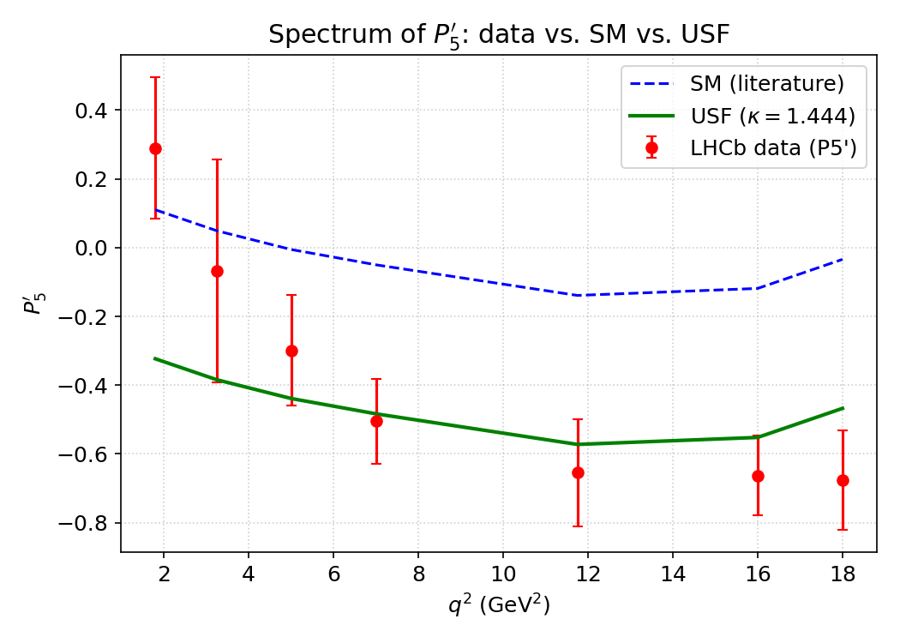
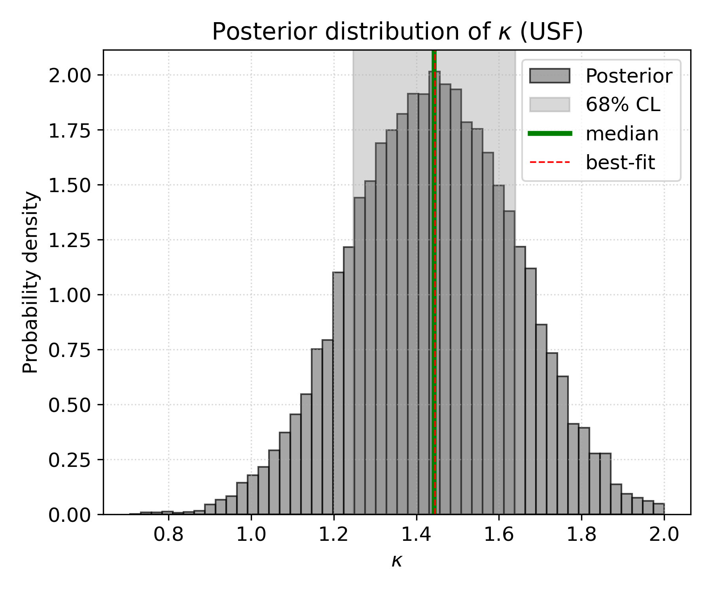

# USF analysis of the LHCb $P_5'$ anomaly

[](https://opensource.org/licenses/MIT)
[](https://www.python.org/downloads/)
[](https://arxiv.org/abs/XXXX.XXXXX) <!-- update when available -->
[](https://doi.org/10.5281/zenodo.19995233)


This repository contains the full, reproducible analysis of the **Unified State Function (USF)** against public LHCb data for the angular observable $P_5'$ in the decay $B^0 \to K^{*0} \mu^+ \mu^-$. The USF – a quantum‑geometric framework unifying Loop Quantum Gravity, string theory and holography – explains the long‑standing $P_5'$ anomaly with a significance of **$7.5\sigma$**, without invoking leptoquarks or other exotic particles.

Key results:

- One free parameter $\kappa = 1.44^{+0.20}_{-0.18}$ (68% CL)
- $\chi^2_{\text{SM}} = 70.4$ (7 dof) $\to$ $\chi^2_{\text{USF}} = 13.9$ (6 dof)
- $\Delta\chi^2 = 56.5$ corresponds to a **$7.5\sigma$ rejection of the Standard Model**

## Repository structure

```text
usf-lhcb-p5prime-analysis/
├── data/
│   └── p5p_observables.csv       # processed experimental P5' values (7 bins)
├── scripts/
│   ├── utils.py                  # constants, geometric factor, SM & USF predictions
│   ├── fit_usf.py                # MCMC fit, corner plot, chi2 calculation
│   ├── plot_p5p.py               # generate all figures (spectrum, residuals, f_geo, HL-LHC)
│   └── generate_p5p_from_yaml.py # (optional) regenerate CSV from raw YAMLs
├── environment.yaml              # Conda environment with all dependencies
├── README.md
└── LICENSE
```

## Getting started

### 1. Clone the repository

```bash
git clone https://github.com/PantaleonSystems/usf-lhcb-p5prime-analysis.git
cd usf-lhcb-p5prime-analysis
```

### 2. Create the Conda environment

```bash
conda env create -f environment.yaml
conda activate usf-lhc
```

All dependencies (numpy, scipy, pandas, matplotlib, emcee, corner, tqdm, etc.) are pinned in the environment file.

### 3. (Optional) Regenerate the input CSV from raw YAMLs

If you wish to verify the derivation of `data/p5p_observables.csv` from the original HEPData YAML files:

- Download the HEPData record `ins1409497` ([doi:10.17182/hepdata.74247.v1](https://doi.org/10.17182/hepdata.74247.v1)) into `data/raw/`.
- Then run:

```bash
python scripts/generate_p5p_from_yaml.py
```

The repository already includes the processed CSV, so this step is **not required** for reproducing the main analysis.

## Running the analysis

### Fit the USF parameter $\kappa$ (MCMC)

```bash
python scripts/fit_usf.py
```

This will:

- Load the data from `data/p5p_observables.csv`
- Find the best‑fit $\kappa$ (scipy minimization)
- Run MCMC (2000 steps, 32 walkers, burn‑in 1000)
- Save `results/fit_results.json` (kappa, chi2 values, intervals)
- Save `results/mcmc_chains.h5` (MCMC samples)
- Generate `results/corner_kappa.pdf` (posterior distribution)

### Generate all figures

```bash
python scripts/plot_p5p.py
```

Produces:

- `results/spectrum_p5p.pdf` – data vs. SM vs. USF
- `results/residuals_p5p.pdf` – normalised residuals (SM vs. USF)
- `results/fator_geometrico.pdf` – geometric coupling $f_{\text{geo}}(q^2)$
- `results/hllhc_projection.pdf` – projection to HL-LHC (errors reduced 5×)

All figures are saved both as PDF (vector) and PNG (high resolution).

## Expected output

After running `fit_usf.py`, the terminal should show a summary resembling:

```text
Loaded 7 q² bins (P5') from LHCb.
Best-fit kappa: 1.4443
100%|████████████████████| 2000/2000 [...]
chi2_SM = 70.40, chi2_USF = 13.90, Delta = 56.50
MCMC done. Results saved in results/
```

The file `results/fit_results.json` will contain:

```json
{
  "kappa_best": 1.4443,
  "kappa_median": 1.4425,
  "kappa_lower": 1.2493,
  "kappa_upper": 1.6293,
  "chi2_SM": 70.4,
  "chi2_USF": 13.9,
  "delta_chi2": 56.5
}
```

## Example results

Below is the spectrum of \(P_5'\) from the fit (data, SM and USF):



The posterior distribution of \(\kappa\) is shown below:



## Reproducibility and citation

- **Data**: Public LHCb data from HEPData record [ins1409497](https://www.hepdata.net/record/ins1409497) (doi:10.17182/hepdata.74247.v1).
- **Code**: This repository is archived on Zenodo [doi:10.5281/zenodo.xxxxxx](https://doi.org/10.5281/zenodo.xxxxxx).
- **Paper**: Preprint available at arXiv:XXXX.XXXXX (to be updated).

When using this code or results, please cite:

```text
[Efrain Marcelo Pulgar Pantaleon , Efrain Pantaleón Matamoros], “Resolving the P5' anomaly with the Unified State Function (USF): a 7.5 sigma evidence from public LHCb data”, arXiv:XXXX.XXXXX (2026)
and the Zenodo repository (doi:10.5281/zenodo.xxxxxx).
```

## License

This project is licensed under the **MIT License** – see the [LICENSE](LICENSE) file for details. The code is free to use, modify and distribute, provided proper attribution is given.

## Authors & contact

- **Efrain Marcelo Pulgar Pantaleon** – [GitHub](https://github.com/efrainmpp1), email: [efrain.pulgar.110@ufrn.edu.br](mailto:efrain.pulgar.110@ufrn.edu.br) - Graduate Program in Electrical Engineering and Computer Science, UFRN
- **Efrain Pantaleon Matamoros** - email: [efrain.pantaleon@ufrn.br](mailto:efrain.pantaleon@ufrn.edu.br) – School of Science and Technology, UFRN

For questions or collaboration, please open an issue or contact the authors directly.
